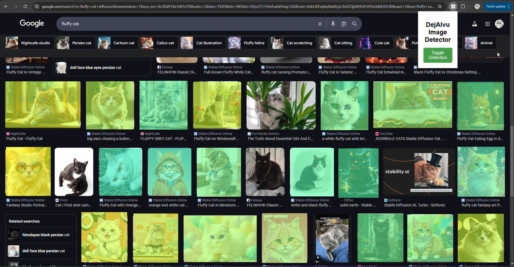

# DejAIvu AI Image Detector Extension

A browser extension to detect AI-generated images and overlay saliency maps to explain the detection.

## Features
- Detects AI-generated images in real-time on any page you're on
- Provides a visual explanation of flagged images using saliency maps.
- Easy-to-use interface to enable or disable detection.
- No images stored and transmitted without consent 

## How to Run

1. **Download the Project:**
   - Clone the repository with `git clone`

2. **Open Chrome Extensions Page:**
   - Go to `chrome://extensions/` in your Chrome browser settings

3. **Enable Developer Mode:**
   - Toggle the switch in the top-right corner to enable **Developer Mode**.

4. **Load Unpacked Extension:**
   - Click the **Load unpacked** button.
   - Select the repo containing the extension files 

5. **Activate the Extension:**
   - Ensure the extension appears in the toolbar.
   - Visit any webpage with images (e.g., Google Images).

6. **Test the Extension:**
   - Toggle the extension in the toolbar
   - Scroll through the page to see the green heat maps on detected images.
